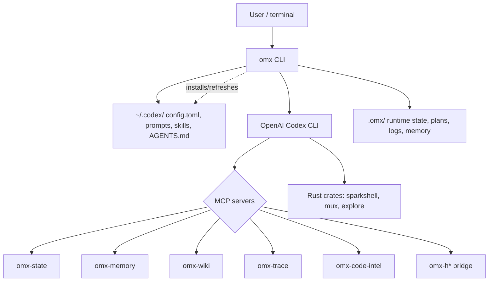
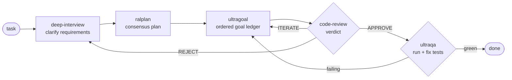
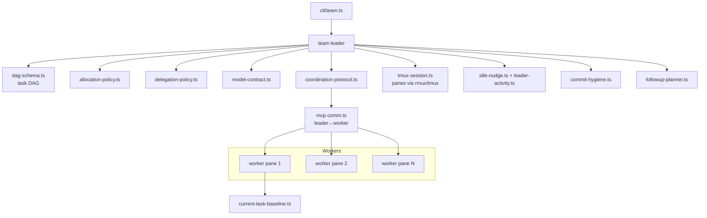
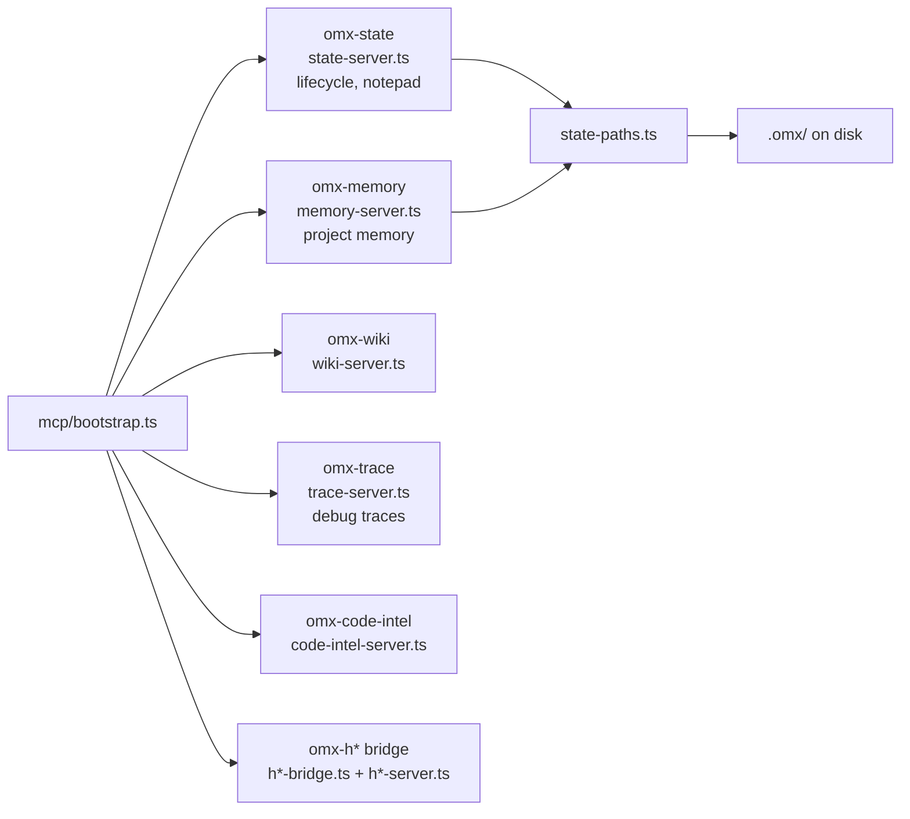
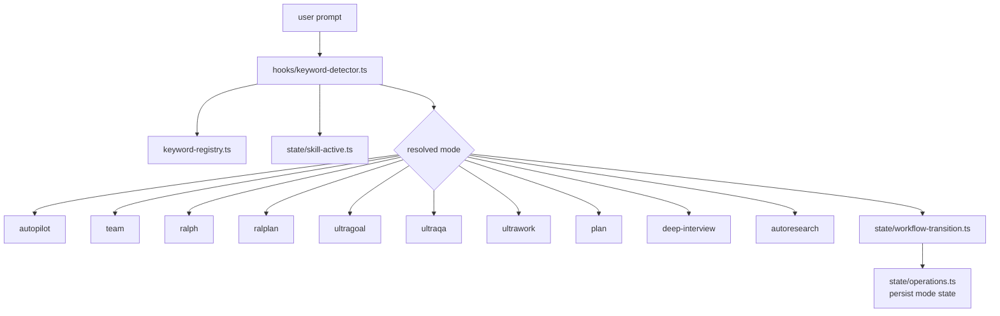
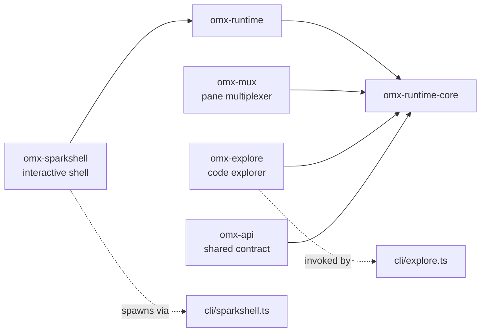

# Architecture

Diagrams render on GitHub (native Mermaid) and in
[`explorer.html`](./explorer.html). Everything below is derived from the
`codegraph` index and `ast-grep` queries against `src/`.

## 1. System context

Where `omx` sits between the user, the Codex CLI, and on-disk state.

## 2. Component map

The top-level `src/` subsystems and how they group. Boxes are directories
under `src/`.

```mermaid
flowchart LR
    subgraph Entry
        CLI[cli/ — omx command router]
        IDX[index.ts — library API]
    end
    subgraph Orchestration
        TEAM[team/ — multi-agent coordination]
        PIPE[pipeline/ — Autopilot stages]
        LEAD[leader/ — leader-side control]
        SUB[subagents/]
        MODES[modes/ + hooks/ — keyword→mode routing]
    end
    subgraph Workflows
        AUTO[autopilot/]
        RALPH[ralph/]
        RALPLAN[ralplan/]
        UG[ultragoal/]
        AR[autoresearch/]
        GW[goal-workflows/]
        PLAN[planning/]
        Q[question/]
        VERIF[verification/]
    end
    subgraph Platform
        MCP[mcp/ — 6 servers]
        STATE[state/ — workflow transitions]
        CFG[config/ — config.toml generation]
        AGENTS[agents/ — 36 definitions + native config]
        CATALOG[catalog/ — prompt/skill catalog]
        RUNTIME[runtime/ + exec/]
        SIDE[sidecar/]
    end
    subgraph IO
        NOTIF[notifications/ + openc*w/]
        HUD[hud/]
        SESS[session-history/]
        URL[url-reader/ + wiki/]
        IMG[imagegen/ + visual/]
        VSC[vscode/]
    end
    CLI --> Orchestration
    CLI --> Workflows
    CLI --> Platform
    Orchestration --> Platform
    Workflows --> Platform
    Platform --> IO
```

## 3. The Autopilot pipeline

The default orchestration loop (`src/pipeline/orchestrator.ts`,
`createAutopilotPipelineConfig`). Each stage is a `PipelineStage` with a
`StageContext` in / `StageResult` out; legacy `team` and `ralph-verify`
adapters remain selectable.

Stage sources: `src/pipeline/stages/{deep-interview,ralplan,ultragoal,code-review,ultraqa}.ts`,
shared base in `stages/base.ts`, types in `pipeline/types.ts`.

## 4. Team orchestration

`team/` runs a leader plus N workers across tmux panes. Workers can be
Codex or Claude (`OMX_TEAM_WORKER_CLI_MAP`). A DAG schedules tasks;
policies decide allocation, delegation, and commit hygiene.

`api-interop.ts` (the largest team file, ~55 KB) is the cross-CLI API
contract that lets Codex and Claude workers speak the same protocol; the
`setup` verifier checks its markers (`verifyTeamCliApiInterop`).

## 5. MCP servers

Six servers registered into Codex via `config.toml`. `bootstrap.ts` wires
them up; `state-paths.ts` centralizes on-disk locations.

## 6. Mode / keyword routing

User phrasing selects a workflow mode. `hooks/keyword-detector.ts` (the
single biggest hook, ~76 KB) matches against `keyword-registry.ts` and the
active-skill state, then drives `state/workflow-transition.ts`.

## 7. Native runtime (Rust)

Six crates under `crates/`, built by `pnpm build:sparkshell` /
`build:explore`. They provide the fast interactive shell and code
exploration that back `omx sparkshell` and `omx explore`.

TypeScript talks to these binaries through `utils/platform-command.ts`,
which now routes bare `tmux` spawns through the `rmux` multiplexer shim
before falling back to real `tmux`.
