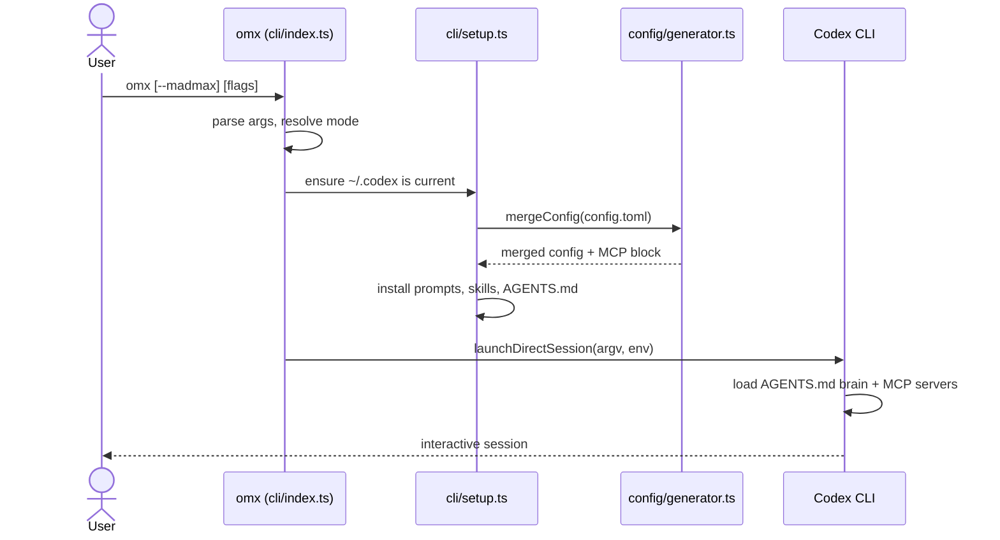
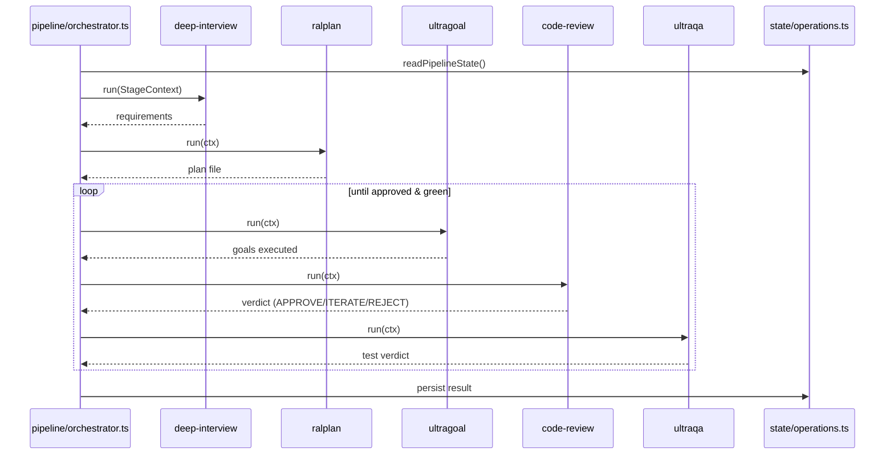
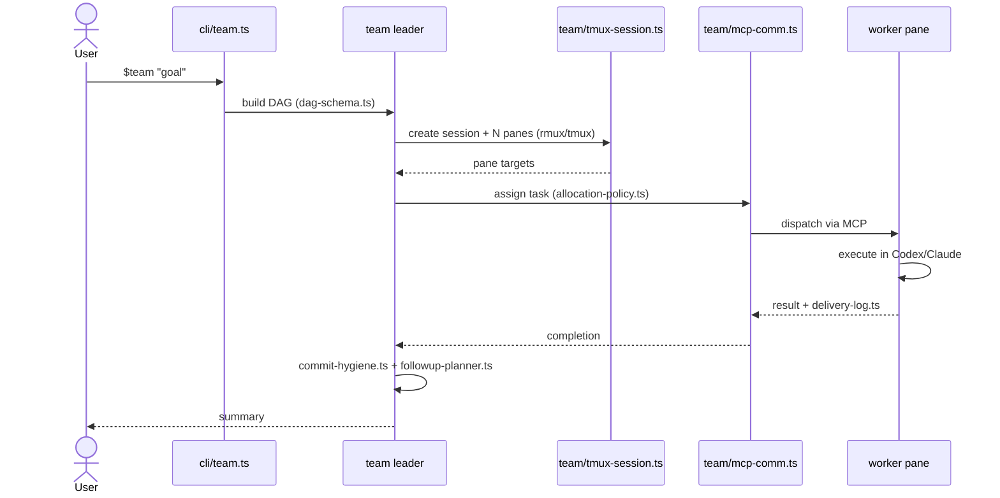
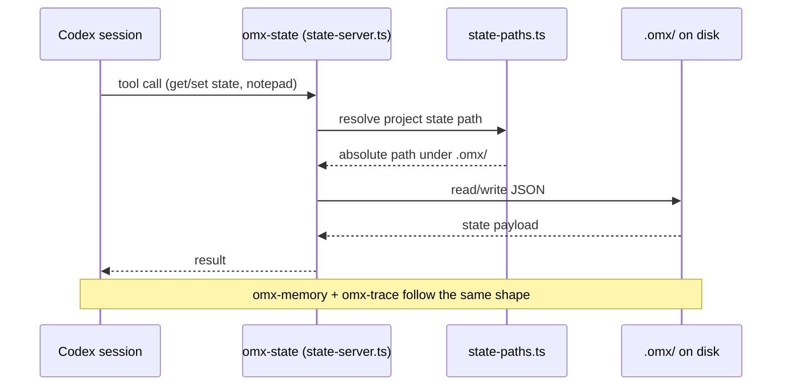
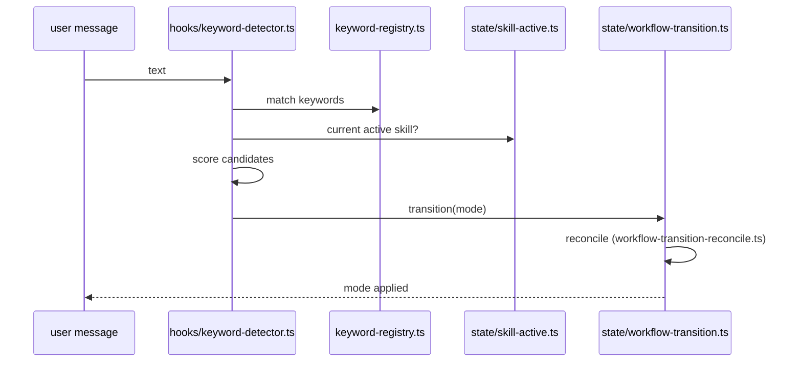

# Data flow

Sequence diagrams for the flows a maintainer hits most. Rendered by
GitHub and by [`explorer.html`](./explorer.html).

## Session launch (`omx`)

From invocation to a running Codex session with OMX config applied.

## Autopilot pipeline run

How one task threads through the five stages.

## Team run

Leader spawns workers, distributes DAG tasks, collects results.

## MCP state read/write

How a running session persists and recalls lifecycle state.

## Mode resolution on each prompt

The hook that decides which workflow a message triggers.

